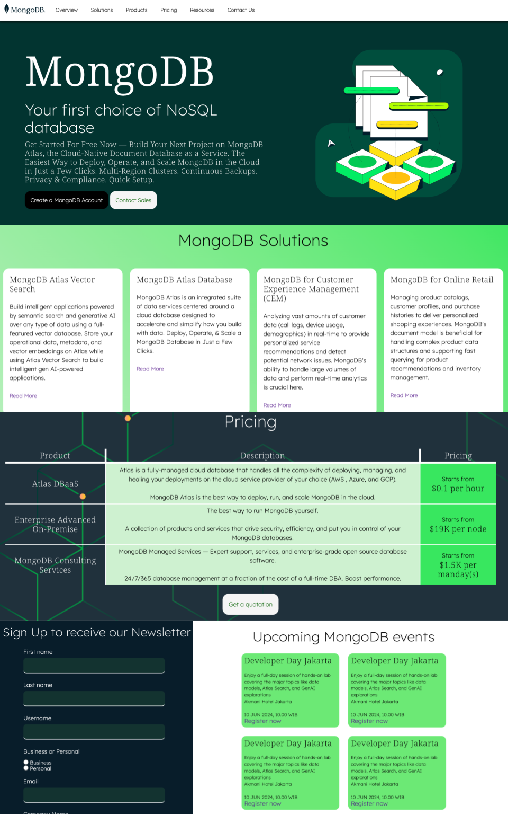

Hi, my name is Yosephine Gita Asaria Hutauruk

# Gita's Profile
Tech sales professional currently working as Account Executive at MongoDB.

## Connect with me
|Socials   |Link   |
|-------|------------|
|LinkedIn   |[Gita Asaria](https://sg.linkedin.com/in/gita-asaria)     | 
|Whatsapp  |+65 83198749     | 
|Instagram   |@yosegita     | 

## What I'm Building
I'm building a simple HTML site for MongoDB so it's easier for people to explore our solutions. In this website, you can navigate through different information, including various MongoDB Solutions across features and industries, pricing information, events, and signed up for accounts or newsletter. 

In building this website, there are 3 main steps that I did:

### 1. Planning the skeleton of the website
This involves understanding the elements necessary to build a proper website. As references I look into mongodb.com own's website, and several other, similar cloud companies like Google and Amazon. 

While MongoDB itself emphasizes on visuals, most of the other websites focus more on providing information. 

Google Cloud Platform's website for example, is heavily loaded with product and pricing information.

From this research, I decided that the website should contain at least:
1. A navigation bar to go through all pages quickly
2. An introductory information about the Product
3. Further details about Solutions
4. Information about Pricing
5. Information about recent Events or Programs
6. Plenty of Click-to-Action: sign up, contact sales, or subscribe to newsletter
