Hi, my name is Yosephine Gita Asaria Hutauruk

# Gita's Profile
Tech sales professional currently working as Account Executive at MongoDB.

## Connect with me
|Socials   |Link   |
|-------|------------|
|LinkedIn   |[Gita Asaria](https://sg.linkedin.com/in/gita-asaria)     | 
|Whatsapp  |+65 83198749     | 
|Instagram   |@yosegita     | 

## What I'm Building
I'm building a simple HTML site for MongoDB so it's easier for people to explore our solutions. In this website, you can navigate through different information, including various MongoDB Solutions across features and industries, pricing information, events, and signed up for accounts or newsletter. 
Visit my website [HERE](mdb-indo.com)

In building this website, there are 3 main steps that I did:

## 1. Planning the skeleton of the website
This involves understanding the elements necessary to build a proper website for a technology solution. As references, I look into [mongodb.com](mongodb.com)'s website - along with several others, including similar cloud companies like Google and Amazon. 

While MongoDB itself emphasizes on visuals, most of the other websites focus more on providing information. [Google Cloud Platform](cloud.google.com)'s website for example, is heavily loaded with product and pricing information without much design. 

From this research, I decided that the website should contain at least:
1. A navigation bar to go through all pages quickly
2. An introductory information about the Product
3. Further details about Solutions
4. Information about Pricing
5. Information about recent Events or Programs
6. Plenty of Click-to-Action: sign up, contact sales, or subscribe to newsletter

## 2. Planning the design of the website
This involves manually sketching the components of the site so that it makes sense to navigate through. It also involves the research on [brand resources](https://www.mongodb.com/company/newsroom/brand-resources), downloading reference images and icons from MongoDB website. 

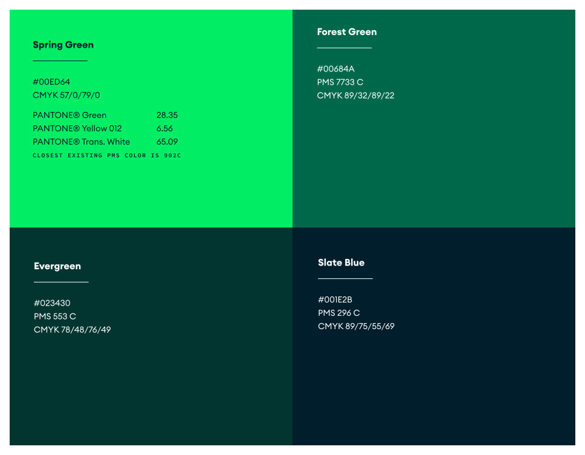

Other than icons and color scheme, an external library for fonts are also required because MongoDB doesn't use standard fonts. Rather, it uses **Lexend Deca** and **Noto Serif**.

## 3. Writing down HTML & CSS
Next is the execution of writing down HTML, CSS, and JS code according to the plans above. Here are some important components that I design. 

### A. Landing Page, Infinitely Sliding Carousel and Navbar 
The landing of the page starts with a simple and visual introduction on MongoDB. This includes big logos, video, and plenty click-to-action buttons. Writing the HTML on this part is rather easy as it does not contain much information, but I spent hours just designing the navbar, header, and 'About Us' section. 

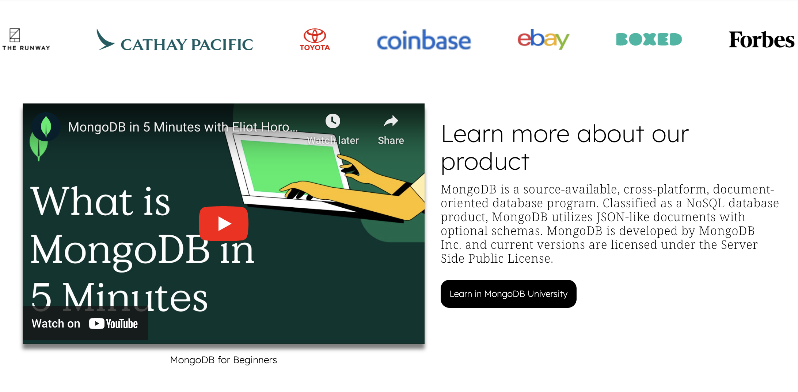

In short, I leverage **Flex** to divide between WORDS and VISUALS - such as between the Title Header and Icon, or About Us with Video (Figure). To make the website more appealing, I created an **infinitely-moving logo carousell** to show visitors a list of notable MongoDB customers. As I couldn't figure this out on my own, I took reference from Youtube videos and external websites. 

I also took sometime designing the **Navbar**. It took a while to clear the default list styling, fixed it afloat on the upper-left part of the page, and style both the default appearance - as well as the appearance on hover. 

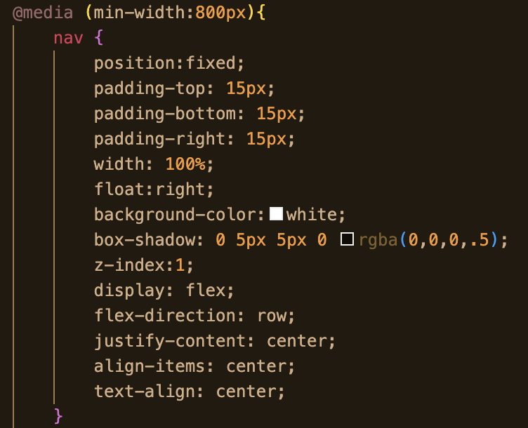
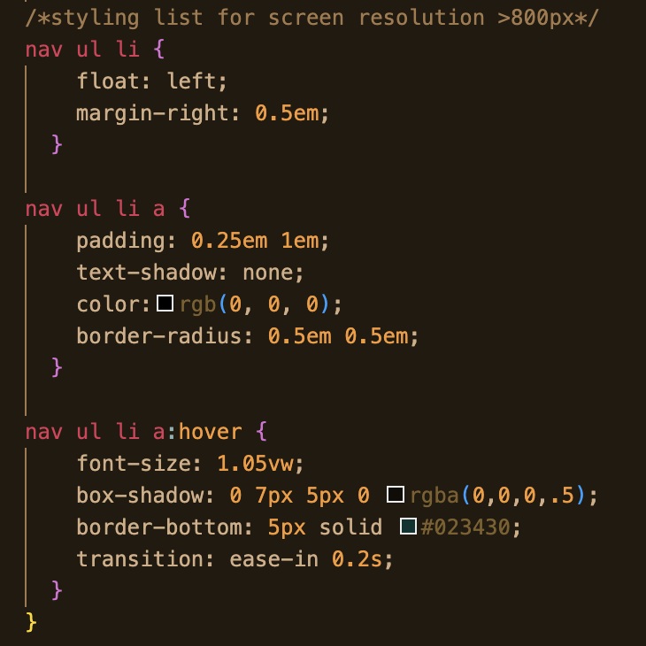

### B. Utilizing Grid, Flex, and Table for contents
Scrolling further down, you'll find multiple information like solutions, pricing, and events. I utilize different styling for each of these elements.
|Elements   |Style   |
|-------|------------|
|Solutions   |Grid|
|Pricing  |Table   |
|Events   |Flex     | 
|Form   |Flex (Double wrapper) | 

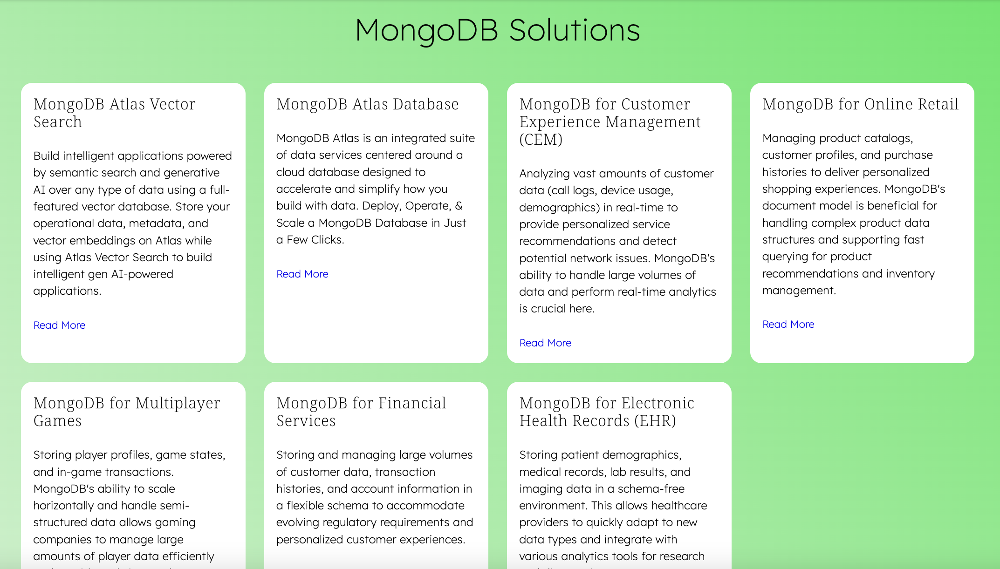
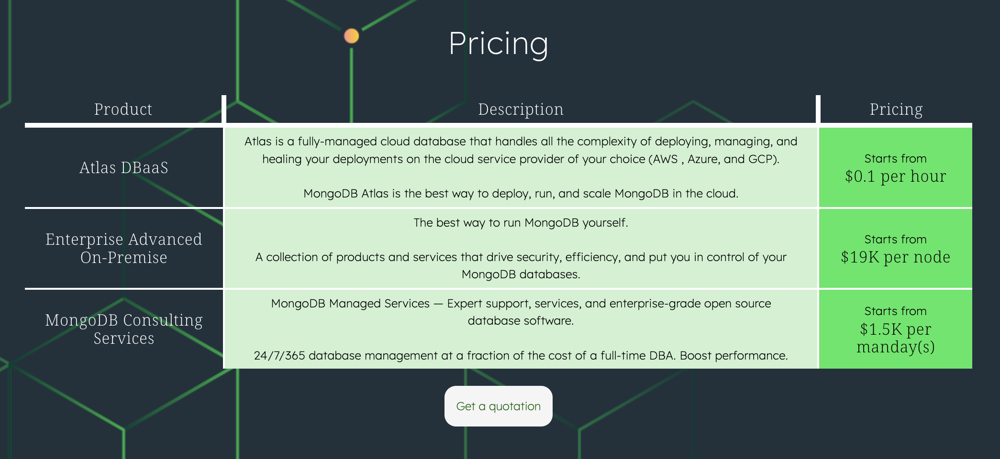

### C. Form and Footer
Other elements that I created include **form**, which itself leverage multiple **flex** wrappers to generate this result. First flex wrapper involve a big **container** that separates the form and form image. Whereby the second flex wrapper arranges **label and input text area** in flex column display.

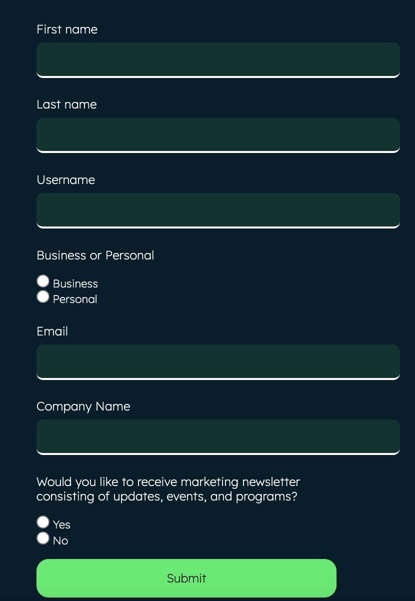

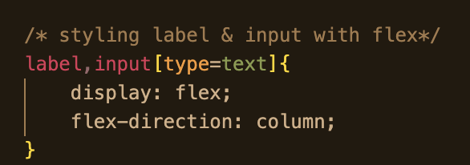
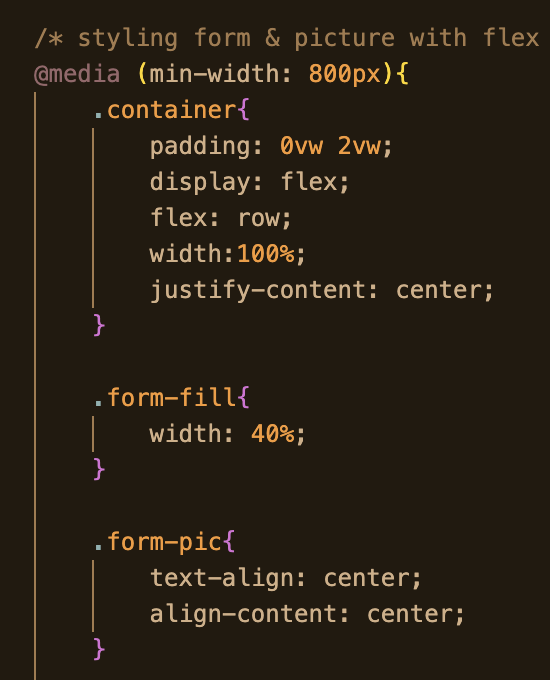

Additionally, to wrap the website at the end of the page, I added a footer than contains MongoDB office and contact information. 

### D. Making Responsive Website
One challengeing aspect of my work includes having to ensure **responsiveness** of the website across different screen sizes. For this, I:
1. Leverage media query that separates between screen <800px and >=800px. I implement this to things like Navbar - which turns into hamburger button once click. I also changed grid and flex arrangement, such as one for the **solutions** section, which reduces the grid column from 4 to 2 when screen size is small.
|Elements   |Style on Smaller Screen  |
|-------|-------------------------------|
|Navbar   |Hamburger Button|
|Header  |Changed Flex direction from Row to Column, text alignment changed, using img srcset |
|About Us   |Changed Flex direction from Row to Column, text alignment changed     | 
|Solutions   |Max Grid column changed from 4 to 2 | 
|Form   |No flex, image hidden|

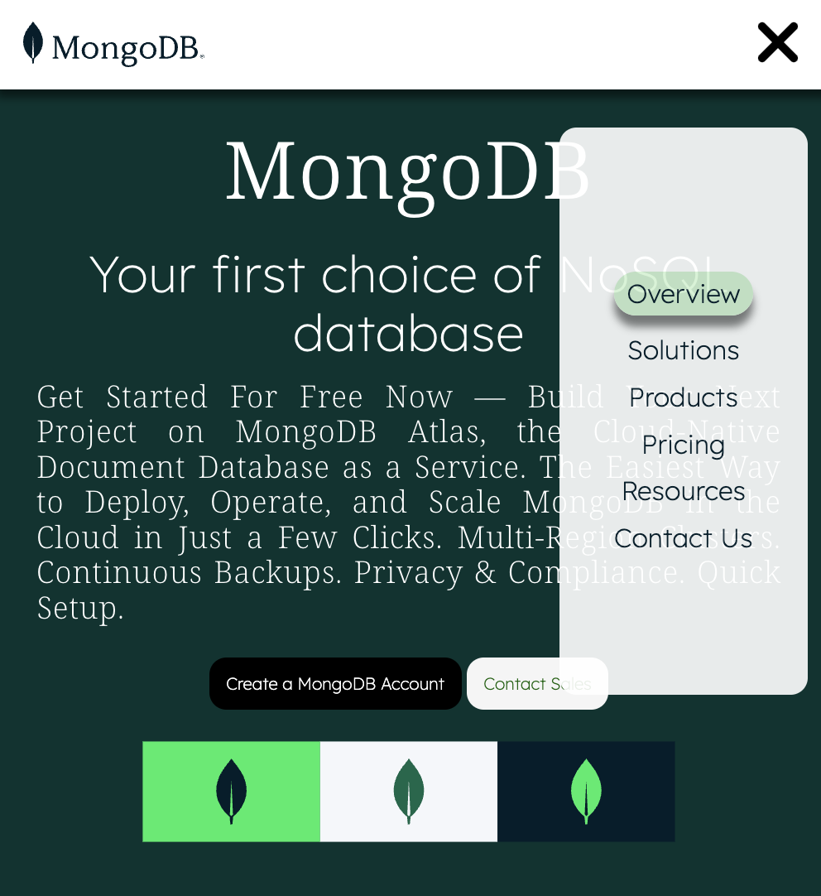

One of the biggest challenge was to implement hamburger button. For this, I watched some useful Youtube tutorials, one of which shows the steps to make hamburger button from scratch, using span & translate. 

We start with designing an 'off-screen menu' at a negative x-axis coordinate (in this case -450px). 
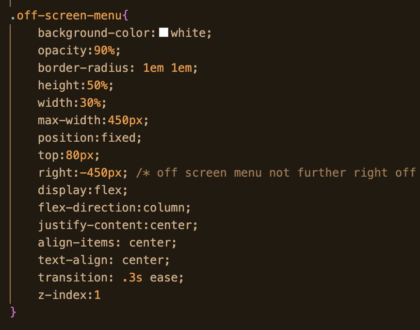

We then bring the x-axis coordinate to positive when status of menu is active. 
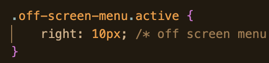

3. Use relative measurements such as vw, vh, and em. I also change units of measurement for **LANDSCAPE** (assuming media screen >800px) and **PORTRAIT** (assuming media screen <800px) - by using **VW** for landscape screen and **VH** for portrait screen (for some objects). This ensures readability across different screen sizes and orientations.

4. Implementing IMG SRCSET so the website will retrieve best-suited image for the screen size - such as one for header. (hint: try reloading your web if the picture is not updated upon screen resize!)
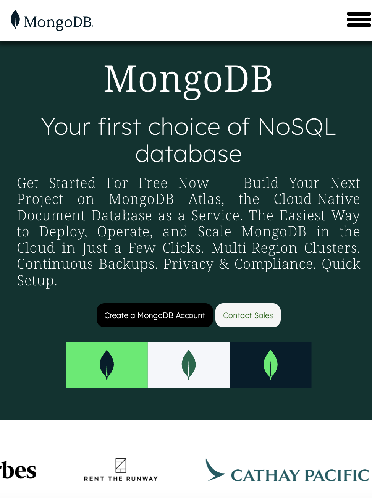
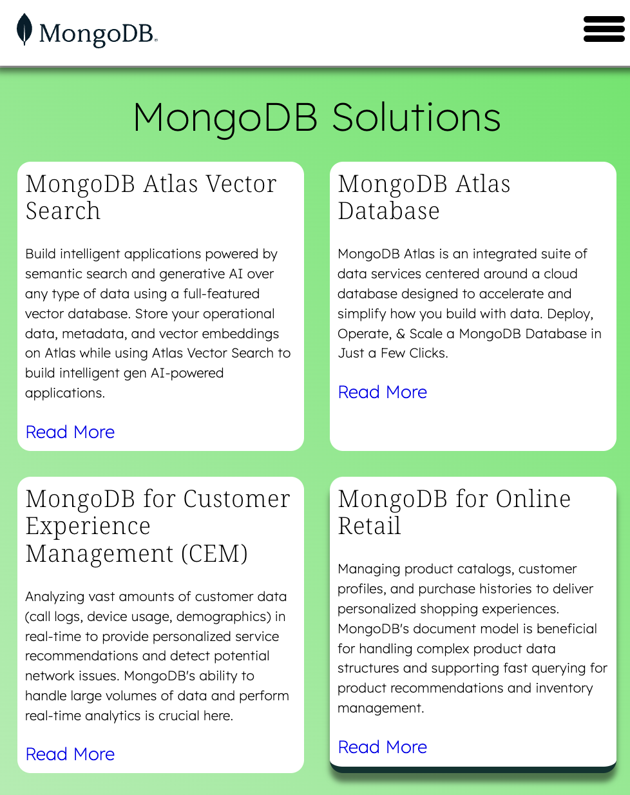

### E. Making Interactive Components
To make the website more appealing, I implemented interactivity using transform (e.g. form and buttons) and translate (e.g. hamburger button turning to X). 

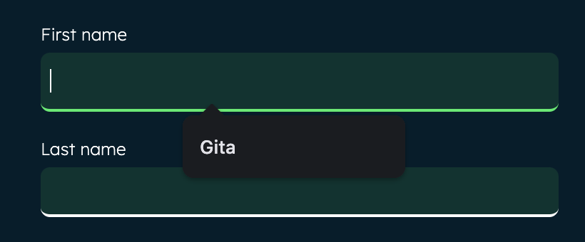

## 4. Deploying the Website
Lastly is the process of deploying the Website. 

For this, I first connected my Github repository to my Netlify account. 
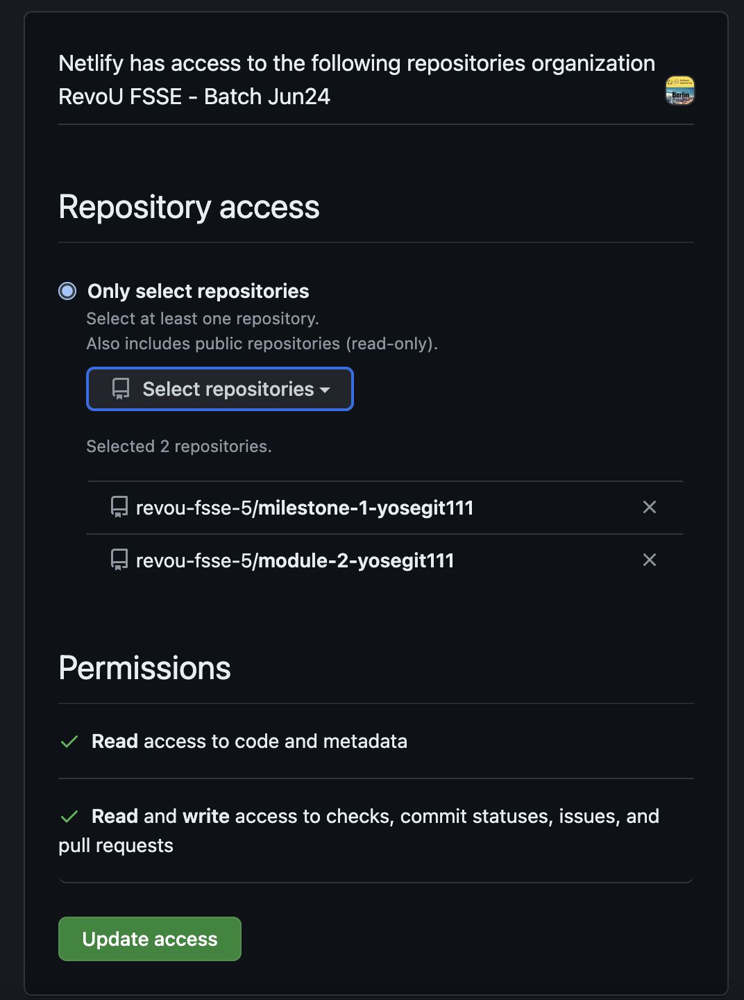

Then, I deployed my page on Netlify. 
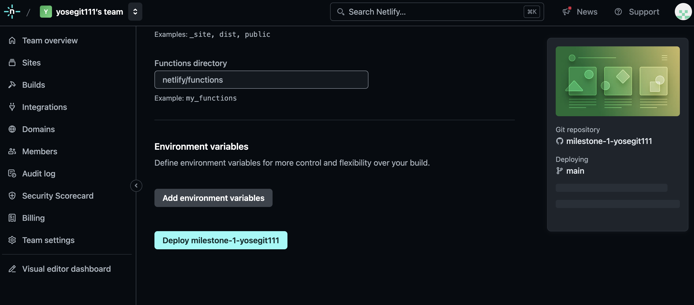

After that, I purchased a domain on Niaga Hoster. 
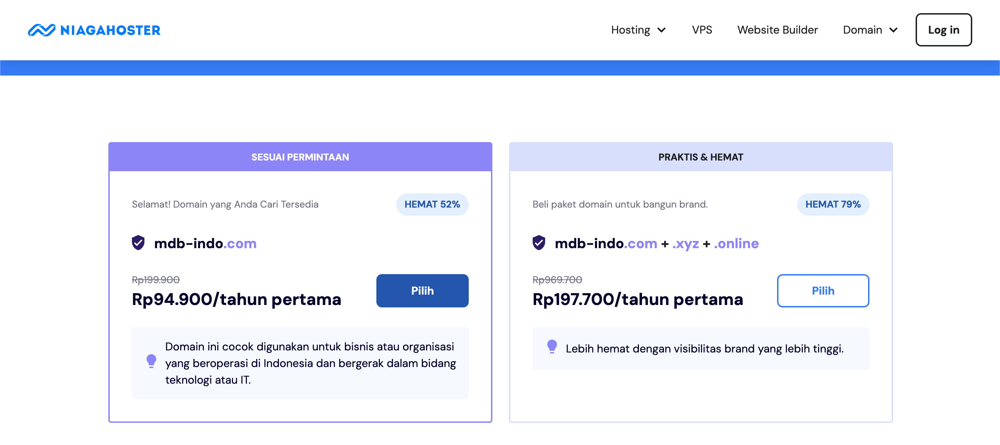

Lastly, I connected my purchased domain on Netlify, as well as configuring the name servers back on Niaga Hoster. 
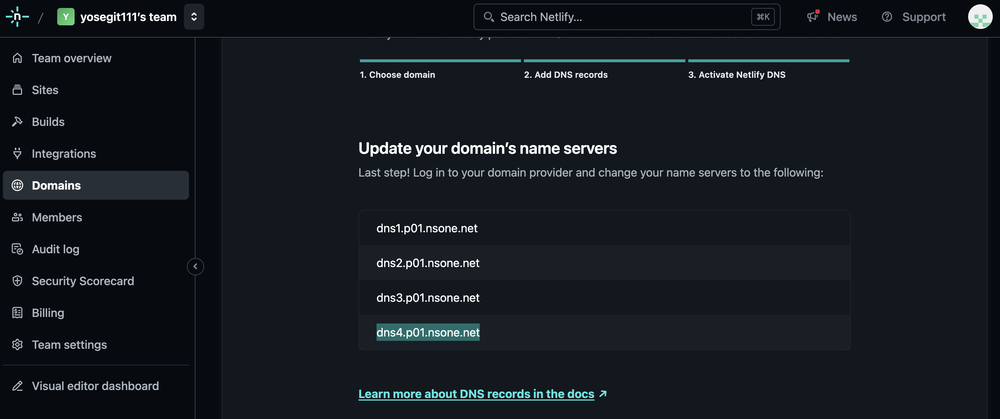

Done, my website is live!
