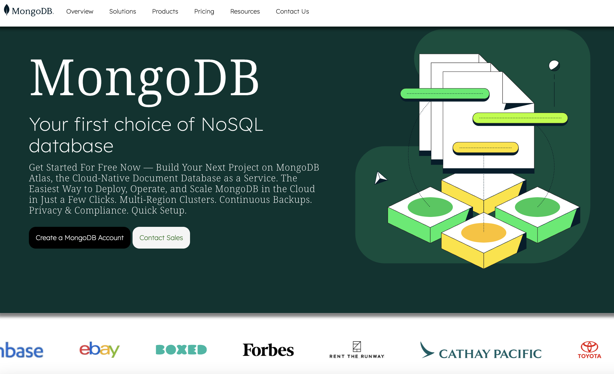

Hi, my name is Yosephine Gita Asaria Hutauruk

# Gita's Profile
Tech sales professional currently working as Account Executive at MongoDB.

## Connect with me
|Socials   |Link   |
|-------|------------|
|LinkedIn   |[Gita Asaria](https://sg.linkedin.com/in/gita-asaria)     | 
|Whatsapp  |+65 83198749     | 
|Instagram   |@yosegita     | 

## What I'm Building
I'm building a simple HTML site for MongoDB so it's easier for people to explore our solutions. In this website, you can navigate through different information, including various MongoDB Solutions across features and industries, pricing information, events, and signed up for accounts or newsletter. 

In building this website, there are 3 main steps that I did:

## 1. Planning the skeleton of the website
This involves understanding the elements necessary to build a proper website. As references I look into mongodb.com own's website, and several other, similar cloud companies like Google and Amazon. 

While MongoDB itself emphasizes on visuals, most of the other websites focus more on providing information. 

Google Cloud Platform's website for example, is heavily loaded with product and pricing information.

From this research, I decided that the website should contain at least:
1. A navigation bar to go through all pages quickly
2. An introductory information about the Product
3. Further details about Solutions
4. Information about Pricing
5. Information about recent Events or Programs
6. Plenty of Click-to-Action: sign up, contact sales, or subscribe to newsletter

## 2. Planning the design of the website
This involves manually sketching and arranging the components of the web, downloading reference images and color scheme of MongoDB websites, such as one shown below. 

These icons and color references are available at MongoDB Brand Resources website [here](https://www.mongodb.com/company/newsroom/brand-resources).

Other than that, I also need to import external font library, which are **Lexend Deca** and **Noto Serif** - two official MongoDB fonts. 

## 3. Writing down HTML & CSS
Next is the execution of writing down HTML, CSS, and JS code according to the plans above. Here are some important components that I design. 

### A. Landing Page, Infinitely Sliding Carousel and Navbar 
The landing of the page starts with a simple and visual introduction on MongoDB. This includes big logos, video, and plenty click-to-action buttons.

I use **Flex** to divide between short description and icon or video. Additionally, I created an **infinitely-moving logo carousell** to show visitors a list of MongoDB customers. 

This first section is very important in ensuring easy navigation for customers, so I designed a **fixed position** Navbar at the very top of the page. 

### B. Utilizing Grid, Flex, and Table for contents
Scrolling further down, you'll find multiple information like solutions, pricing, and events. I utilize different css styling for each of these elements. For **solutions part**, I use Grid for all screen resolutions. Meanwhile, I only use Table for **pricing**. Then, I leverage **flex** for **events** when screen resolution is above 800px, and **grid** when screen resolution is less than 800px.

### C. Form and Footer
Other elements that I created include **form**, which itself leverage multiple **flex** wrappers to generate this result. First flex wrapper involve a big **container** that separates the form and form image. Whereby the second flex wrapper arranges **label and input text area** in flex column display.

Additionally, to wrap the website at the end of the page, I added a footer than contains MongoDB office and contact information. 

### D. Making Responsive Website
One challengeing aspect of my work includes having to ensure **responsiveness** of the website across different screen sizes. For this, I:
1. Leverage media query that separates between screen <800px and >=800px. I implement this to things like Navbar - which turns into hamburger button once click. I also changed grid and flex arrangement, such as one for the **solutions** section, which reduces the grid column from 4 to 2 when screen size is small.

2. Use relative measurements such as vw, vh, em, and many more. I also change units of measurement for **landscape** (assuming media screen >800px) and **portrait** (assuming media screen <800px) - by using **vw** for landscape screen and **vh** for portrait screen for some objects. This ensures readability across different screen sizes and orientation.

3. Implementing img srcset so the website will retrieve best-suited image for the screen size - such as one for header. (hint: try reloading your web if the picture is not updated upon screen resize!)

### E. Making Interactive Components
To make the website more appealing, I implemented interactivity using transform (e.g. form and buttons) and translate (e.g. hamburger button turning to X). 

## 4. Deploying the Website
Lastly is the process of deploying the Website. 

For this, I first connected my Github repository to my Netlify account. 

Then, I deployed my page on Netlify. 

After that, I purchased a domain on Niaga Hoster. 

Lastly, I connected my purchased domain on Netlify, as well as configuring the name servers back on Niaga Hoster. 

Done, my website is live!
